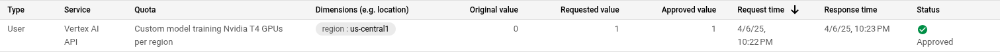

Forked from the original repo https://github.com/dtsip/in-context-learning

This repository contains a setup for running training on Google Cloud Vertex AI with GPU acceleration. None of the original code has been modified. (Except for: train.py where model weights and training results are stored into a Google Cloud Storage bucket.)

# In-Context Learning

This repository contains the code and models for the paper:

**What Can Transformers Learn In-Context? A Case Study of Simple Function Classes** <br>
*Shivam Garg\*, Dimitris Tsipras\*, Percy Liang, Gregory Valiant* <br>
Paper: http://arxiv.org/abs/2208.01066 <br><br>


```bibtex
    @InProceedings{garg2022what,
        title={What Can Transformers Learn In-Context? A Case Study of Simple Function Classes},
        author={Shivam Garg and Dimitris Tsipras and Percy Liang and Gregory Valiant},
        year={2022},
        booktitle={arXiv preprint}
    }
```

## Running training on Google Cloud Vertex AI

### Prerequisites

- Docker
- Google Cloud account
- Weights & Biases (WandB) account

Also this repo is inteded setup on linux, your system may differ slightly.

### Vertex AI training run
If someone (only 1 person on the team has to do this) already has set up the Vertex AI Infrastructure one simply needs to:

1. Add a 'service-account-key.json' to the root of this repo.

2. Login to Weights & Biases (WandB) and add your [API key](https://wandb.ai/settings#api) to the environment variables. (Rename .env.example to .env and add your API key to the file). It is also necessary to change the fields project: <wand_project>  entity: <wandb_entity> in the file `src/conf/wandb.yaml`.

3. Update `example-run.sh` with your project id, artifact registry name and bucket name.

4. Install dependencies:

   ```bash
   pip install -r requirements.txt
   ```

5. Run the training script:

   ```bash
   ./example-run.sh
   ```

### Vertex AI Infrastructure Setup

Setting up Vertex AI can be a bit tedious if one is not familiar with the process, but it's really quite straightforward. Tip: set location to `us-central1` consistently for all services to avoid any issues down the line.

0. Claim your $300 at [Google Cloud Console](https://console.cloud.google.com/) and create a new project.

1. Log into the [Google Cloud Console](https://console.cloud.google.com/), activate the necessary APIs:
- [Google Cloud Storage](https://console.cloud.google.com/storage/overview)
- [Google Artifact Registry](https://console.cloud.google.com/artifacts)
- [Google Vertex AI](https://console.cloud.google.com/vertex-ai)

2. Create a [service account](https://console.cloud.google.com/iam-admin/serviceaccounts) and download the key. Rename it to `service-account-key.json` and add it to the root of this repo.

3. Create a bucket in [Google Cloud Storage](https://console.cloud.google.com/storage/overview)

4. Create a artifact registry in [Google Artifact Registry](https://console.cloud.google.com/artifacts)

5. Optionally you can skip steps 3, 4 and instead navigate to '/infra' and run the terraform scripts there. (PS: requires terraform installed) (P.P.S: add project id to main.tf)

```bash
cd infra
terraform init
terraform plan
terraform apply
```

6. Now add the created bucket name, and aritfact registry name to the top of `example-run.sh`.

7. Login to Weights & Biases (WandB) and add your [API key](https://wandb.ai/settings#api) to the environment variables. (Rename .env.example to .env and add your API key to the file). It is also necessary to change the fields project: <wand_project>  entity: <wandb_entity> in the file `src/conf/wandb.yaml`.

8. Even though Google is generously providing $300 worth ofcompute they keep their GPU's close to the chest. Navigate to [quotas](https://console.cloud.google.com/iam-admin/quotas), search for T4's (or other) and request a quota increase. The process will fail without a quota increase. Make sure the location matches the one specified previously (e.g. us-central1)



9. Then if the all of the above has been set up successfully run the training script:

   ```bash
   ./example-run.sh
   ```

### Description of key additions:

All the original source code from Garg et al. has been preserved in the `src` directory. Except for: train.py where model weights and training results are stored into a Google Cloud Storage bucket.


example-run.sh - this script:
   - Builds a Docker container with all dependencies
   - Pushes it to Google Artifact Registry
   - Launches a Vertex AI training job with the specified configuration
   - Logs training results to Weights & Biases
   - Stores weights and training-results in the Google Cloud Storage bucket when the run has completed

entrypoint.sh - This bash script is run inside the container when the runtime environment starts. Among other tasks it executes `python src/train.py --config src/conf/toy.yaml`.

vertex_job.py - Helper for starting training jobs on Vertex AI

Customize the training run by modifying parameters in `example-run.sh` or providing Weights & Biases integration for experiment tracking.


### Maintainer(s) of GCP Vertex AI setup
* [Sveinung Myhre](https://github.com/svemyh) | <s.myhre@berkeley.edu>

## Original Maintainers
* [Shivam Garg](https://cs.stanford.edu/~shivamg/)
* [Dimitris Tsipras](https://dtsipras.com/)